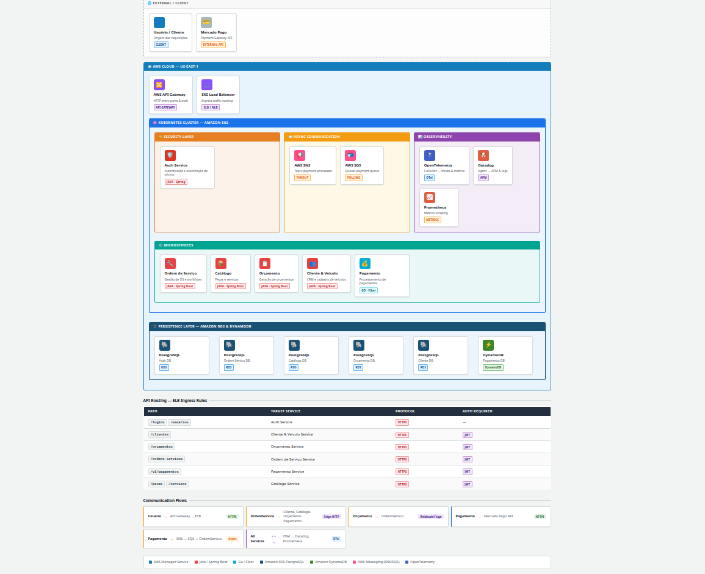

# 📝 Serviço de Gerenciamento de Ordens de Serviço

Microserviço responsável pelo gerenciamento completo do ciclo de vida das ordens de serviço, desde a abertura, diagnóstico, execução, aprovação de orçamento, até a finalização e entrega.

---

## 📋 Descrição

O **Serviço de Gerenciamento de Ordens de Serviço** é um microserviço construído em **Java 21** com **Spring Boot** e **PostgreSQL**. A sua arquitetura é baseada no padrão **Ports and Adapters (Arquitetura Hexagonal)**, que isola a lógica de negócio de detalhes de infraestrutura.

O sistema foi projetado para simular processos típicos de uma oficina, como:

-   Abertura e gerenciamento de ordens de serviço
-   Registro de diagnóstico e itens necessários
-   Gerenciamento da execução da ordem de serviço
-   Aprovação e vínculo com orçamentos
-   Finalização e entrega
-   Comunicação com outros microserviços (Cliente, Catálogo, Orçamento)
-   Segurança e controle de acesso

A aplicação foi desenvolvida com foco em **boas práticas**, **DDD**, e uma arquitetura limpa para garantir **separação de responsabilidades**, **testabilidade** e **manutenibilidade**.

---

## 🛠️ Tecnologias Utilizadas

-   **Java 21**
-   **Spring Boot**
-   **PostgreSQL**
-   **Gradle** (gerenciamento de dependências)
-   **JUnit 5** (testes automatizados)
-   **AWS** (deploy na cloud)


---

## Documentação da API

A documentação da API está disponível via Swagger UI. Para acessá-la, inicie a aplicação e entre em:
```
http://localhost:9091/swagger-ui/index.html
```

---

## 🧪 Testando a API com Insomnia

Para facilitar os testes e o consumo da API, uma collection do Insomnia está disponível no projeto. Você pode importá-la diretamente no seu Insomnia a partir do seguinte arquivo:

- [**Collection Insomnia - Ordem de Serviço**](docs/collections/ordem-servico-insomnia-collection.yaml) <!-- Placeholder: Update with actual path if exists -->

---

## 🚀 Como Executar Localmente

Existem duas formas de executar o projeto localmente, dependendo do seu objetivo.

### Opção 1: Apenas a Aplicação (com Docker Compose)

Esta é a forma mais rápida e simples de subir a aplicação e o banco de dados, ideal para desenvolvimento focado na API.

1.  Navegue até o diretório `ordem_servico/`.
2.  Para executar, rode o comando:

    ```bash
    docker-compose up
    ```
3.  A aplicação estará disponível em `http://localhost:9091`.

4.  Para acessar a documentação interativa e testar os endpoints, abra o Swagger UI no seu navegador:
    ```
    http://localhost:9091/swagger-ui/index.html
    ```
Obs: É necessário definir a variavel de ambiente DD_API_KEY para a integração com o datadog funcionar corretamente


### Opção 2: Ambiente Kubernetes Completo (com Minikube)

Esta abordagem simula um ambiente Kubernetes real na sua máquina, sendo ideal para testar os manifestos e a interação completa do serviço.

#### 1. Pré-requisitos

- **Docker:** [Instruções de instalação](https://docs.docker.com/engine/install/)
- **kubectl:** [Instruções de instalação](https://kubernetes.io/docs/tasks/tools/install-kubectl/)
- **Minikube:** Siga o guia de instalação oficial para o seu sistema operacional.
- **Link Oficial:** https://minikube.sigs.k8s.io/docs/start/

#### 2. Inicie o Cluster Minikube

Abra seu terminal e execute o comando para iniciar o cluster:
```bash
minikube start
```

Habilitar metrics-server:

```bash
minikube addons enable metrics-server
```

#### 3. Configure o Ambiente Docker

Este é o passo mais importante. Você precisa configurar seu terminal para usar o ambiente Docker de dentro do Minikube. Isso garante que a imagem que você construir estará visível para o Kubernetes.
```bash
eval $(minikube -p minikube docker-env)
```

**Dica:** Você precisará rodar este comando em cada novo terminal que abrir para interagir com o Minikube.


#### 4. Construa e Aplique os Manifestos Kubernetes

1.  Navegue até o diretório `ordem_servico/`.
2.  Construa a imagem Docker do microserviço:
    ```bash
    docker build -t alexmarquesfa/ordemservicooficina:latest .
    ```
    (Substitua `alexmarquesfa/ordemservicooficina` pelo nome da sua imagem no Docker Hub, se aplicável).
3.  Aplique os manifestos Kubernetes usando Kustomize a partir da raiz do projeto:
    ```bash
    kubectl apply -k ordem_servico/k8s/base/
    ```
    Ou, para um overlay específico (ex: ambiente de desenvolvimento):
    ```bash
    kubectl apply -k ordem_servico/k8s/overlays/dev/ # ou producao, homolog, etc.
    ```

Após alguns instantes, todos os recursos (Pods, Services, Deployments, etc.) para o serviço de `ordem_servico` estarão sendo criados.

#### 5. Acesse a Aplicação

Para obter a url de acesso ao serviço, que foi exposto como `NodePort`, use o seguinte comando do Minikube. Ele abrirá a URL diretamente no seu navegador:
```bash
minikube service ordem-servico-app-service -n oficina-ns
```

#### 7. (Opcional) Monitoramento e Limpeza

- **Verificar status dos Pods:** `kubectl get pods -n oficina-ns -l app=ordem-servico-app`
- **Parar o cluster:** `minikube stop`
- **Deletar o cluster:** `minikube delete`

---

## 🔄 Fluxo de CI/CD (GitHub Actions)

O projeto utiliza GitHub Actions para automação de integração e deploy contínuo. Os workflows específicos para este microserviço estão definidos em `.github/workflows` dentro do diretório `ordem_servico/`.

### CI - Integração Contínua (`ordem_servico/.github/workflows/ci-pipeline.yml`)

Este pipeline é acionado a cada `push` em uma branch com o padrão `feature/*` e quando há alterações no diretório `ordem_servico/`. Seu objetivo é garantir a qualidade e a integridade do código antes que ele seja mesclado à `main`.

-   **Etapas:**
    1.  **Build e Testes:** Compila o código Java da aplicação e executa todos os testes unitários.
    2.  **Validação Docker:** Constrói a imagem Docker para garantir que o `Dockerfile` está funcionando.
    3.  **Criar Pull Request:** Se todas as etapas anteriores passarem, um Pull Request é criado automaticamente para a branch `main`, sinalizando que a feature está pronta para revisão.

### CD - Deploy Contínuo (`ordem_servico/.github/workflows/cd-pipeline.yml`)

Este pipeline é acionado automaticamente após um `merge` na branch `main` e quando há alterações no diretório `ordem_servico/`. Seu objetivo é colocar a nova versão da aplicação em produção no ambiente da AWS.

-   **Etapas:**
    1.  **Publicar Imagem no Docker Hub:** Constrói a imagem Docker da aplicação, a identifica com uma tag única (o hash do commit) e a envia para o Docker Hub.
    2.  **Deploy da Aplicação:** Executa os seguintes passos:
        -   Usa `kustomize` para atualizar o manifesto do `Deployment` com a tag da nova imagem Docker.
        -   Usa `kubectl apply` para aplicar os manifestos Kubernetes no cluster EKS.
        -   Verifica o status do rollout para garantir que a nova versão subiu com sucesso.

---

## 📂 Estrutura Interna do Microserviço (Ports and Adapters)

Este módulo segue a arquitetura hexagonal, organizada da seguinte forma:

```text
├── core/                     # O núcleo do domínio (coração da aplicação)
│   ├── domain/               # Contém as entidades, VOs e regras de negócio puras
│   ├── port/                 # Define as "portas" (interfaces) de comunicação
│   │   ├── in/               # Portas de entrada (o que a aplicação oferece, ex: IAtualizarClienteUseCase)
│   │   └── out/              # Portas de saída (o que a aplicação precisa, ex: IClienteRepository)
│   └── usecase/              # Implementação das portas de entrada, orquestrando a lógica
│
└── adapters/                 # Implementações concretas das portas
    ├── in/                   # Adaptadores de entrada (driving adapters)
    │   └── controller/       # Ex: Controladores REST que recebem requisições HTTP
    └── out/                  # Adaptadores de saída (driven adapters)
        └── persistence/      # Ex: Implementação do repositório usando Spring Data JPA
```

-   **Core**: É o centro da aplicação, livre de dependências externas (frameworks, bancos de dados). Contém a lógica de negócio pura.
-   **Ports**: São as interfaces que definem os contratos de comunicação. As portas de entrada (`in`) são implementadas pelos `usecases`, enquanto as portas de saída (`out`) são implementadas pelos adaptadores de persistência ou clientes de outras APIs.
-   **Adapters**: São a "ponte" entre o núcleo e o mundo exterior. Eles adaptam as tecnologias específicas (como HTTP, JPA, etc.) para as interfaces definidas nas portas.

Essa estrutura garante que o núcleo da aplicação permaneça isolado e testável, independentemente das tecnologias utilizadas na camada de infraestrutura.
---


## 📜 Licença

Este projeto está sob a licença MIT. Veja o arquivo [LICENSE](../../LICENSE) para mais detalhes.


## 🏗️ Arquitetura do Sistema

Abaixo está o desenho da arquitetura da solução baseada em AWS EKS:



> Você também pode visualizar a versão original em HTML aqui: [Desenho de Arquitetura AWS](docs/aws.html)